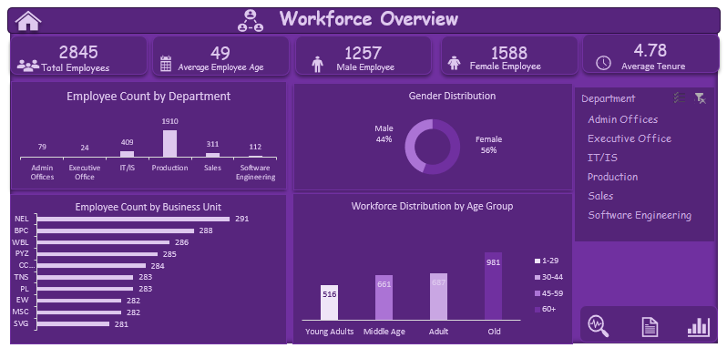
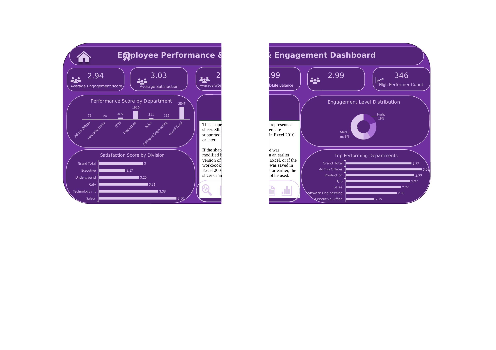
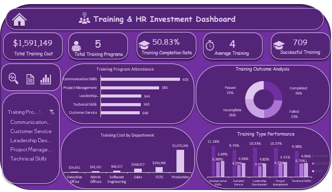

# HR Analytics Dashboard — Workforce, Performance & Training Insights

A 3-dashboard Excel analytics project analyzing 2,845 employees across engagement, performance, and training investment.

`Excel` `Pivot Tables` `Data Visualization` `Dashboard Design` `HR Analytics`

---

## Business Problem

Leadership is spending **$1.59M a year on training** and managing a **2,845-person workforce** with no consolidated view of whether that investment is working. Engagement (2.94/5), satisfaction (3.03/5), and work-life balance (2.99/5) all sit right at the midpoint — not a crisis, but not healthy either — and training outcomes split almost evenly across Completed / Passed / Failed / Incomplete (~25% each), meaning roughly half of all training doesn't result in a clear pass.

Without a way to see performance, engagement, and training spend side by side, HR can't tell *which* departments or programs are driving that ~50% ineffective-training rate, or whether the $1.07M going into Production (67% of the total training budget) is actually paying off in performance or retention terms.

**The ask:** give HR a single view that connects headcount, performance, engagement, and training spend by department — so they can see where training dollars are underperforming and where engagement risk is quietly building, before it shows up as attrition.

## Overview

This project was built as part of a 30-day Excel/data analytics challenge. Starting from a raw HR dataset (2,845 employee records, 35 fields — demographics, performance ratings, engagement/satisfaction surveys, and training history), I cleaned and modeled the data, built pivot-table-driven KPIs, and designed three interactive dashboards to answer the question above.

## Process

- **Data prep:** Reviewed and validated 35 fields per employee (tenure, department, division, performance score, engagement/satisfaction/work-life balance scores, training outcomes and cost); checked derived fields like Age Group, Engagement Level, and Performance Category for consistency.
- **Analysis layer:** Built a dedicated Analysis sheet with 9 pivot-table blocks, each isolating one KPI (headcount, average engagement, average satisfaction, training cost, completion rate, tenure, performance distribution, department breakdown, training outcome mix).
- **Dashboard design:** Grouped the 9 KPI blocks into three themed dashboards, each with card-style KPI callouts, chart visualizations, a slicer for interactive filtering, and consistent navigation.

## The Three Dashboards

### 1. Workforce Overview
Headcount (2,845), average age (49), gender split (56% female / 44% male), average tenure (4.78 years), headcount by department and business unit, workforce distribution by age group.

### 2. Employee Performance & Engagement
Average engagement (2.94/5), satisfaction (3.03/5), and work-life balance (2.99/5) scores; performance and satisfaction by department/division; engagement-level distribution; top-performing departments by rating.

### 3. Training & HR Investment
Total training spend ($1.59M), program count, completion rate, training attendance by program, cost by department, training outcome/type performance.

## Key Insights

- **Production dominates headcount and cost.** Production is 67% of the workforce (1,910 of 2,845) and accounts for 67% of total training spend ($1.07M of $1.59M) — cost is scaling proportionally with headcount, a useful sanity check for a budget review.
- **Training outcomes are close to a coin flip.** Completed, Passed, Failed, and Incomplete are each roughly a quarter of all training records — no outcome dominates, suggesting current programs aren't consistently effective and are worth a root-cause pass by program and delivery type.
- **Engagement and satisfaction cluster at the midpoint.** All three sentiment scores sit near the middle of a 5-point scale — flagging an organization that's neither clearly thriving nor struggling, exactly the kind of "quiet risk" a dashboard should surface before it shows up in attrition.
- **Performance skews positive but has a real tail.** 2,251 employees "Fully Meet" expectations and 346 "Exceed," but 162 "Need Improvement" — worth cross-referencing against the training completion data above.
- **Division-level satisfaction has a real spread.** Satisfaction by division ranges from 3.17 (Executive) to 3.50 (Safety) — enough to prioritize where to start an engagement follow-up.

## Recommendations

1. Investigate the ~25%-each training outcome split by program and delivery type (Internal vs. External) to find which specific programs are underperforming.
2. Pair the Performance dashboard with attrition/exit data (not in this dataset) to test whether "Needs Improvement" correlates with training failures.
3. Use the department-level training cost view to evaluate ROI — Production's training spend should be checked against its performance/engagement scores, not just its headcount share.

## Skills Demonstrated

Excel pivot tables & pivot charts · dashboard/UI design in Excel · KPI definition · data cleaning and validation · translating a flat dataset into a decision-support tool · business-oriented insight writing

